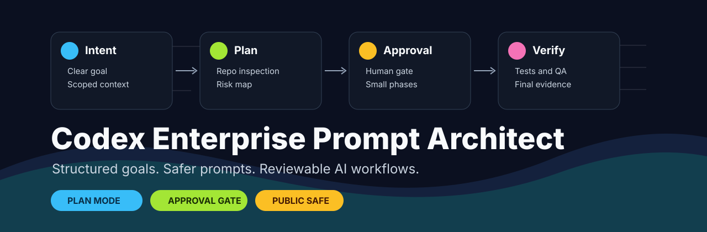
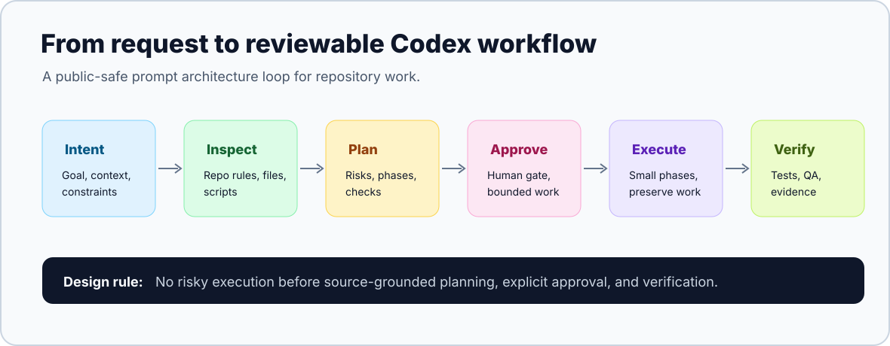

# Prompt Architect

> Structured Codex prompt patterns, approval-gated workflows, and safety checklists for reviewable AI-assisted development.

<p align="center">
  
  <br />
  
</p>

<p align="center">
  &#127760; <strong>Languages:</strong>
  <a href="README.de.md"></a> |
  <a href="README.es.md"></a> |
  <a href="README.md"></a> |
  <a href="README.pt-BR.md"></a> |
  <a href="README.tr.md"></a> |
  <a href="README.fr.md"></a>
</p>

<!-- bilingual-welcome:start -->
<table>
  <tr>
    <td width="50%" valign="top">
      <h3> English welcome</h3>
      <p>Prompt Architect packages source-backed Codex prompt patterns, approval-gated execution modes, safety checklists, and reviewable AI-assisted development workflows.</p>
      <p><strong>Start here:</strong> <a href="docs/USAGE.md">Usage modes</a> explains the operating model.</p>
    </td>
    <td width="50%" valign="top">
      <h3> Türkçe karşılama</h3>
      <p>Codex'e iş verirken kapsamı, onayı, güvenliği ve doğrulamayı en başta netleştirmek için kullandığım prompt mimarisi seti. Amaç, işi büyütmeden önce niyeti, sınırı ve kontrol adımlarını yazıya dökmek.</p>
      <p><strong>Buradan başla:</strong> Türkçe anlatım için <a href="README.tr.md">README.tr.md</a>; modları görmek için <a href="docs/USAGE.md">kullanım dokümanı</a>.</p>
    </td>
  </tr>
</table>
<!-- bilingual-welcome:end -->

[](https://github.com/ucsahinn/prompt-architect/releases)
[](LICENSE)
[](SECURITY.md)
[](docs/USAGE.md)
[](README.md)
[](https://github.com/ucsahinn/prompt-architect/actions/workflows/docs-validate.yml)
[](docs/PUBLIC_REPO_CHECKLIST.md)

- **Status:** v1.1.1 public release
- **License:** MIT
- **Project type:** Markdown-based Codex skill package and Prompt Lab knowledge base
- **Note:** Independent community project. Not affiliated with, endorsed by, or sponsored by OpenAI.

Prompt Architect helps turn vague AI coding requests into scoped, safer, and verifiable Codex prompts. It is built for teams and maintainers who want Codex to inspect first, plan clearly, wait for approval on risky work, and report evidence instead of just saying "done".

##  Operator Command Center

| Signal | Use it when | Start here |
| --- | --- | --- |
|  Prompt architecture | You need a ready-to-paste Codex prompt with scope, verification and stop rules. | [Skill entrypoint](.codex/skills/prompt-architect/SKILL.md) |
|  Plan-first control | The repo is broad, risky, security-sensitive or release-adjacent. | [PLAN MODE ONLY](docs/USAGE.md#no-goal-plan-mode-only) |
|  Approved execution | A plan has been reviewed and implementation can start. | [APPROVED - EXECUTE](docs/USAGE.md#approved-execute) |
|  Source-backed work | Current docs, MCP behavior, security guidance or repo claims matter. | [Source maintenance](docs/SOURCE_MAINTENANCE.md) |
|  Release confidence | You need local checks before commit, push or release. | [Validation](docs/VALIDATION.md) |
|  Specialist routing | A broad task needs code mapping, docs research, security or release review. | [Subagents](docs/SUBAGENTS.md) |

##  Enterprise Evaluator Path

| If you need to prove... | Start with | Evidence you get |
| --- | --- | --- |
| The repository is public-safe | [Public repo checklist](docs/PUBLIC_REPO_CHECKLIST.md) | Secret, local-path, private-prompt and generated-artifact guardrails. |
| The prompt workflow has human control | [Usage modes](docs/USAGE.md) | `PLAN MODE ONLY`, `APPROVED - EXECUTE`, `STOP / RECOVER` and `PROMPT_ONLY` paths. |
| The skill can be copied into a Codex workspace | [Install guide](docs/INSTALL.md) | File layout, copy path and setup expectations. |
| The security boundary is explicit | [Security model](docs/SECURITY_MODEL.md) | No-secret, disclosure, prompt privacy and verification rules. |
| The examples are usable | [Examples](docs/EXAMPLES.md) | Copy-ready prompts with scope, verification and stop conditions. |

##  Operating Guarantees

| Signal | Standard |
| --- | --- |
| Skill-first routing | Prompts are shaped around reusable skill instructions instead of one-off loose chat. |
| Approval gates | Risky execution is separated from planning and requires an explicit approval step. |
| Verification pressure | Generated prompts ask for tests, scans, browser QA or an honest unverified report. |
| Public-safe knowledge base | Research notes, templates and outputs avoid secrets, private prompts, customer data and local operator paths. |

##  Why This Exists

AI coding agents are useful, but loose prompts create loose outcomes. A good Codex workflow should state the goal, context, constraints, non-goals, verification, output format, and stop conditions before the agent starts changing files.

This repository packages those patterns as:

- a reusable Codex skill,
- prompt templates,
- workflow playbooks,
- security and browser-QA guidance,
- prompt evaluation rubrics,
- source-backed notes for AI coding-agent workflows.

##  Start Fast

| I want to... | Use this |
| --- | --- |
| Generate a safe Codex prompt | [Skill entrypoint](.codex/skills/prompt-architect/SKILL.md) |
| Keep Codex from editing too early | [no-Goal PLAN MODE ONLY](docs/USAGE.md#no-goal-plan-mode-only) |
| Approve a scoped implementation | [APPROVED - EXECUTE](docs/USAGE.md#approved-execute) |
| Stop an agent that left scope | [STOP / RECOVER](docs/USAGE.md#stop-recover) |
| Check public repo safety | [Public repo checklist](docs/PUBLIC_REPO_CHECKLIST.md) |
| Review leak-prevention rules | [Security model](docs/SECURITY_MODEL.md) |



##  What You Get

| Capability | What it gives you |
| --- | --- |
| Goal + Full Prompt | A short objective plus a complete first-message prompt. |
| no-Goal `PLAN MODE ONLY` | Strict planning control before any file edits. |
| `APPROVED - EXECUTE` | A bounded execution prompt after human review. |
| `STOP / RECOVER` | A recovery prompt for premature execution or scope drift. |
| Browser QA | UI verification instructions for real user flows. |
| Security constraints | No-secret, approval-gated rules for sensitive work. |
| Prompt rubric | A way to score prompt quality before use. |

##  Who This Is For

- Developers using Codex for real repository work.
- Prompt engineers building reusable agent instructions.
- Maintainers who want safer public documentation and prompt examples.
- Product, UI, security, and platform teams that need approval-gated AI coding workflows.
- Turkish and English users who want clear Codex workflow examples.

##  Quick Start

Copy the skill directory into your Codex project:

```text
.codex/skills/prompt-architect/
```

Then ask Codex:

```text
Use the prompt-architect skill to create a Codex prompt for: [your task]
```

For strict control, ask for a no-Goal plan-only prompt:

```text
Create a no-Goal PLAN MODE ONLY Codex prompt for: [your task]. Do not allow execution before approval.
```

For prompt-only output:

```text
Only output the final prompt. No commentary. Create a Codex prompt for: [your task]
```

##  Navigation

| Goal | Go to |
| --- | --- |
| Install or copy the skill | [docs/INSTALL.md](docs/INSTALL.md) |
| Learn the main usage modes | [docs/USAGE.md](docs/USAGE.md) |
| Copy practical examples | [docs/EXAMPLES.md](docs/EXAMPLES.md) |
| Understand the skill layout | [docs/SKILL_STRUCTURE.md](docs/SKILL_STRUCTURE.md) |
| Run local validation | [docs/VALIDATION.md](docs/VALIDATION.md) |
| Maintain source-backed notes | [docs/SOURCE_MAINTENANCE.md](docs/SOURCE_MAINTENANCE.md) |
| Route specialist agents safely | [docs/SUBAGENTS.md](docs/SUBAGENTS.md) |
| Decide skill vs plugin packaging | [docs/PLUGIN_READINESS.md](docs/PLUGIN_READINESS.md) |
| Check public repo safety rules | [docs/PUBLIC_REPO_CHECKLIST.md](docs/PUBLIC_REPO_CHECKLIST.md) |
| Prepare GitHub metadata | [docs/GITHUB_SETTINGS.md](docs/GITHUB_SETTINGS.md) |
| Improve discoverability | [docs/SEO.md](docs/SEO.md) |
| Review prompt/security boundaries | [docs/SECURITY_MODEL.md](docs/SECURITY_MODEL.md) |
| See planned improvements | [docs/ROADMAP.md](docs/ROADMAP.md) |

##  Trust Signals

| Area | Standard |
| --- | --- |
| Public safety | No secrets, private prompts, customer data, local paths, or private URLs. |
| Human control | Risky work starts with `PLAN MODE ONLY` and waits for explicit approval. |
| Verification | Prompts require tests, QA, scans, or clear "unable to verify" reporting. |
| CI gate | The dependency-free Prompt Lab validator runs in GitHub Actions. |
| Source discipline | Current or unstable claims use source cards with confidence and outdated-risk notes. |
| Documentation | README stays concise; deeper guidance lives in `docs/` and `knowledge/`. |
| Maintenance | Changelog, release notes, security policy, contribution guide, issue templates. |

##  What This Is Not

This is not:

- an official OpenAI project,
- a Codex replacement,
- an app, API, hosted service, or automation platform,
- a package that calls external APIs by itself,
- a place to store secrets, private prompts, customer data, or credentials,
- a replacement for code review, security review, or engineering judgment.

It is a practical instruction system for designing, running, and reviewing Codex workflows with less ambiguity.

##  Core Workflow Modes

###  Goal + Full Prompt

Use when a persistent high-level objective helps Codex keep the definition of done in view.

###  no-Goal PLAN MODE ONLY

Use when Codex must inspect the repository and produce a plan before any edits. This is the safer default for broad, risky, security-sensitive, production-adjacent, or multi-file work.

###  APPROVED - EXECUTE

Use only after reviewing a plan. The execution prompt should tell Codex to follow the approved plan, preserve unrelated work, implement in small phases, verify, and stop if new facts expand scope.

###  STOP / RECOVER

Use when Codex starts editing too early or leaves scope. The recovery prompt should stop work, list changed files and commands run, avoid automatic revert, and return to plan-only mode.

##  Repository Structure

```text
.
|-- .codex/skills/prompt-architect/
|   |-- SKILL.md
|   |-- commands.md
|   |-- response-modes.md
|   |-- codex-patterns.md
|   |-- examples.md
|   `-- knowledge/
|-- .github/
|   |-- ISSUE_TEMPLATE/
|   |-- workflows/
|   `-- pull_request_template.md
|-- docs/
|   |-- INSTALL.md
|   |-- USAGE.md
|   |-- EXAMPLES.md
|   |-- FAQ.md
|   |-- SKILL_STRUCTURE.md
|   |-- VALIDATION.md
|   |-- SOURCE_MAINTENANCE.md
|   |-- SUBAGENTS.md
|   |-- PLUGIN_READINESS.md
|   |-- PUBLIC_REPO_CHECKLIST.md
|   |-- SEO.md
|   |-- GITHUB_SETTINGS.md
|   |-- SECURITY_MODEL.md
|   `-- ROADMAP.md
|-- knowledge/
|   |-- distilled/
|   |-- templates/
|   |-- sources/
|   |-- outputs/
|   `-- logs/
|-- README.md
|-- README.tr.md
|-- package.json
|-- scripts/
|   |-- validate-prompt-lab.mjs
|   `-- install-prompt-architect.ps1
|-- SECURITY.md
|-- CONTRIBUTING.md
|-- CHANGELOG.md
`-- RELEASE_NOTES.md
```

##  Prompt Ledger

Reusable generated prompts are logged in:

```text
knowledge/outputs/generated-prompts.md
```

Small one-off `PROMPT_ONLY` outputs are logged only when reusable, important, or explicitly requested.

##  Public Safety Rules

This repository is designed for public, reusable prompt and workflow patterns. It must not contain:

- API keys, tokens, credentials, cookies, private keys, or private URLs,
- customer data or internal company information,
- private system prompts,
- proprietary implementation details,
- unredacted logs, screenshots, local paths, or personal notes.

Before publishing changes, use [docs/PUBLIC_REPO_CHECKLIST.md](docs/PUBLIC_REPO_CHECKLIST.md) and [docs/SECURITY_MODEL.md](docs/SECURITY_MODEL.md).

For local release checks, run:

```powershell
node scripts/validate-prompt-lab.mjs
```

##  Contributing

Contributions are welcome when they improve Codex prompt clarity, safety, examples, documentation, or source-backed workflow guidance. See [CONTRIBUTING.md](CONTRIBUTING.md).

##  Security

Do not open public issues for vulnerabilities, leaked credentials, private prompts, or accidental disclosure. See [SECURITY.md](SECURITY.md).

##  License

MIT. See [LICENSE](LICENSE).
